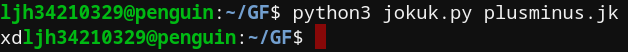

# 조국
>### "언어가 이러니까 나라가 이꼴이지"
  

## 경) 추석배 불속성 효자톤 2등상 수상 (축

## 언어 스펙
길이가 30000인 버퍼가 존재한다.  
버퍼는 0으로 초기화 된다.  
버퍼를 가리키는 포인터가 존재.   
포인터는 0으로 초기화 된다.  

## 명령어
**+**  

> 읽는 수 문자 증가.

  
**-** 
>읽는 수 문자 감소.  
>1이하로 감소될 수 없다.  

**#** 
> +,-로 증감된 수 만큼 #다음에 오는 숫자 문자를 읽는다.   
> 버퍼 저장이 활성화 되어있지 않다면 포인터에 대입한다.  
> 활성화 되어있다면 포인터가 가리키는 버퍼에 삽입한다.  

**%** 
>포인터가 가리키는 버퍼의 수를 포인터에 대입한다.

**,** 
>포인터가 가리키는 버퍼의 수를 로드 한다.   
>최대 2개가 로드 될 수 있으며 연산하기 전까지는 비울 수 없다.  

**.** 
>버퍼 저장 활성화

**?** 
> 포인터가 가리키는 버퍼의 수를 아스키코드로써 출력한다.

**(** 
> 로드된 두 수를 덧셈후 포인터가 가리키는 버퍼에 삽입한다.

**)** 
> 로드된 두 수를 뺄셈후 포인터가 가리키는 버퍼에 삽입한다.

**^** 
> 라벨

**<** 
> 포인터가 가리키는 버퍼의 수가 0이 아니라면 이전의 "^"로 돌아간다.

## 사용 예

###  1. Hello World! 예제
    +#13 .#72                                               
    #12 +.#101-
    #11 +.#108-
    #10 +.#108--
    #9 ++.#111--
    #8 +.#32-
    #7 +.#87-
    #6 ++.#111--
    #5 ++.#114--
    #4 ++.#108--
    #3 ++.#100--
    #2 +.#33-
    #1 +.#10
    
    #15 .#13
    #16 -.#1
    +
    ^
    #15%?#15,#16,#15)
    <
#### 1.1 설명
+로 읽을 숫자를 늘린후 포인터를 13번 버퍼에 가리키게 한다.  
. 명령어를 사용해 #다음에 오는 숫자들을 버퍼에 저장함을 알리고 Hello World!의 아스키 코드를 ! 부터 역순으로 13번 버퍼부터 1번 버퍼까지 삽입한다.  
중간중간 숫자의 길이에 맞춰 +와 - 연산자를 사용해준다.  

13번 버퍼부터 1번 버퍼까지 루프를 돌기 위해 포인터를 15번 버퍼에 가리키게 하고 13을 삽입한다.  
포인터가 16번 버퍼를 가리키게하고 1을 삽입한다.  

루프 시작점에 루프 라벨 ^ 을 기입한다.  
포인터를 15번 버퍼를 가리키게 한 후(#15) 15번 버퍼 안에 있는 수를 포인터에 대입한다(%)  
포인터가 가리키는 버퍼의 값을 아스키 코드로써 출력한다(?)  
포인터를 다시 15번 버퍼를 가리키게 한 후 로드(#15,)  
포인터를 16번 버퍼를 가리키게 한 후 로드(#16,)  
저장할 버퍼에 포인터를 가리키고(#15) 뺄셈을 한다( ")" )  
15번 버퍼안의 수가 0이 되지 않았다면 루프 라벨으로 돌아간다("<")  
#### 1.2 결과

### 2. 간단 덧셈, 뺄셈

    #0 ++.#110--                                            
    #1 +.#10-
    #0,#1,#2(
    #0,#1,#3)
    #2?#3?
#### 2.1 설명
포인터를 0번 버퍼를 가리키게 한 후 ++로 읽을 수를 2개 늘린 후 . 명령어를 사용해 0번 버퍼에 110 숫자를 대입한다.  
포인터를 1번 버퍼를 가리키게 한 후 +로 읽을 수를 1개 늘린 후 . 명령어를 사용해 1번 버퍼에 10 숫자를 대입한다.  
0번 버퍼 로드, 1번 버퍼 로드후 포인터를 2번 버퍼에 가리키게 한 후 덧셈하여 저장한다.  
0번 버퍼 로드, 1번 버퍼 로드후 포인터를 3번 버퍼에 가리키게 한 후 뺄셈하여 저장한다.  
#### 2.2 결과

